# TO-DO-App

(Developer: Robin Bosch)


[Live webpage](https://robin-bosch.github.io/CI_PP2_TO-DO-App/)

## Table of Content

1. [Project Goals](#project-goals)
    1. [User Goals](#user-goals)
2. [User Experience](#user-experience)
    1. [Target Audience](#target-audience)
    2. [User Requirements and Expectations](#user-requirements-and-expectations)
    3. [User Stories](#user-stories)
3. [Design](#design)
    1. [Design Choices](#design-choices)
    2. [Colors](#colors)
    3. [Fonts](#fonts)
    4. [Structure](#structure)
    5. [Wireframes](#wireframes)
4. [Technologies Used](#technologies-used)
    1. [Languages](#languages)
    2. [Frameworks](#frameworks)
    3. [Tools](#tools)
    4. [Pages](#pages)
5. [Features](#features)
6. [Validation and Testing](#validation-and-testing)
    1. [HTML Validation](#html-validation)
    2. [CSS Validation](#css-validation)
    3. [JavaScript Validation](#javascript-validation)
    4. [Accessibility](#accessibility)
    5. [Performance](#performance)
    6. [Device testing](#device-testing)
    7. [Browser compatibility](#browser-compatibility)
    8. [Testing user stories](#testing-user-stories)
7. [Bugs](#bugs)
8. [Deployment](#deployment)
9. [Credits](#credits)
    1. [Media](#media)
    2. [Code](#code)
    3. [Acknowledgements](#acknowledgements)
10. [License](#license)

## Project Goals

### User Goals

- Have a small To-Do-App to track tasks
- Create tasks, Read them, Update them, Delete them
- Mark tasks as done or active
- Use To-Do-App locally

### Site Owner Goals

- Help user with a small To-Do-App
- Show off repository
- Get the user to subscribe to the newsletter

## User Experience

### Target Audience

- Every day people who want a small browser based To-Do-App for free
- People who are unorganised
- People who don't like to send their data to a server

### User Requirements and Expectations

- Easy to use and easy to understand
- Can do basic CRUD-operations (Create, Read, Update, Delete tasks)
- Can mark tasks as done or active
- Get notified at the alert date

### User Stories

As a user I want to:

1. View all my tasks
2. See the details of one task
3. Turn off notifications for one task
4. Turn off all notifications
5. Mark a task as done or active
6. Create a new task
7. Edit a task

    - Edit only the title
    - Edit only the description
    - Edit only the due date
    - Edit only the alert date

8. Delete a task
9. Change the user settings
  
    - Change the theme
    - Change the alert sound
    - Change the alert volume

As a owner I want the user to

10. subscribe to my newsletter
11. know who made the website
12. see the code and how its made

## Design

### Design Choices

The website is designed as a Single Page Application. It is a full width layout and focused on giving the user all the information they need.  
Modals are put into place for Creating/Editing a task, for changing user settings or to subscribe to the newsletter.  

### Colors

The website is mainly white with black text but the accent color is a custom color.  
The colors can changed in the user settings. The following colors are available:  
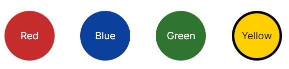

### Fonts

The Inter font from Google Fonts was chosen for its visual clarity. It is easily readable and friendly to the eye. The second font is sans-serif if the font is not loading.  
[Link to Inter font](<https://fonts.google.com/specimen/Inter>)

### Structure

The structure is very simple. It is a Single Page Application with modals that pop up if user input is required.  
The top of the page allows the user to access the user settings and create new tasks.  
The main page is structured in the task list and task overview.  
There is a small section at the bottom, to subscribe to the newsletter and visit the github repository.

#### Task list

The task list shows the list of tasks categorised in active and done tasks. Clicking one task will show it in the overview.
Tasks can be marked as done on the left with the checkcircle.  

#### Task overview

The task overview shows the details of the current selected task, such as: Title, description, due date and alert date.  
The user can edit the task, delete it or mark it as done in the overview.  

#### There are three different modals that can pop up

- Add/Edit task (depending on the state)
- User settings
- Newsletter (Only pops up when prompted at the bottom)

#### Notifications

There are notification popups in the bottom right corner for warnings or reminders. They disappear after a short time or can be closed with the button.

### Wireframes

<details>
 <summary>Home</summary>
 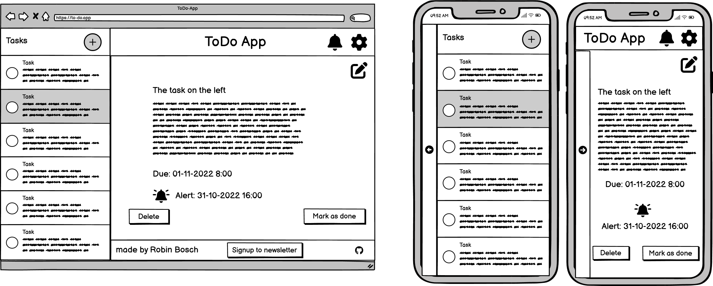
</details>
<details>
 <summary>Create/Edit task modal</summary>
 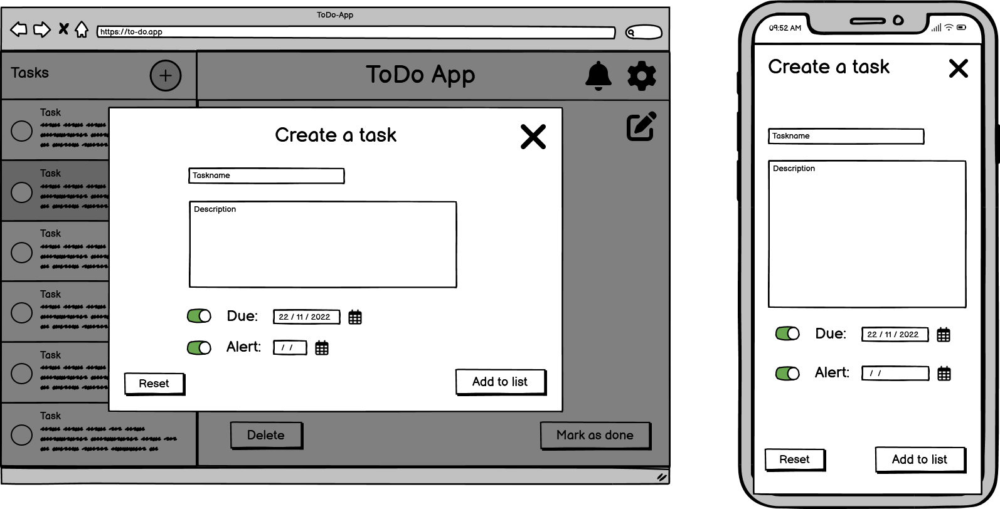
</details>
<details>
 <summary>User settings modal</summary>
 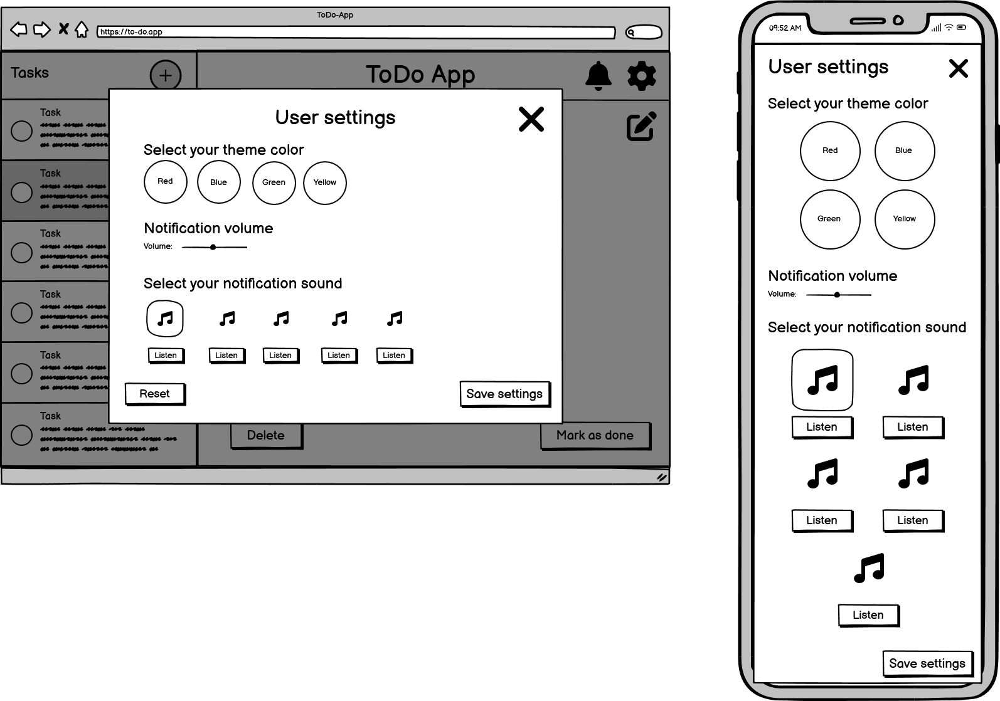
</details>
<details>
 <summary>Newsletter modal</summary>
 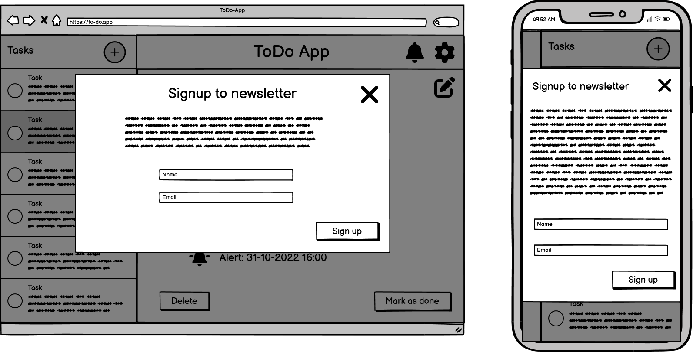
</details>
<details>
 <summary>404 page</summary>
 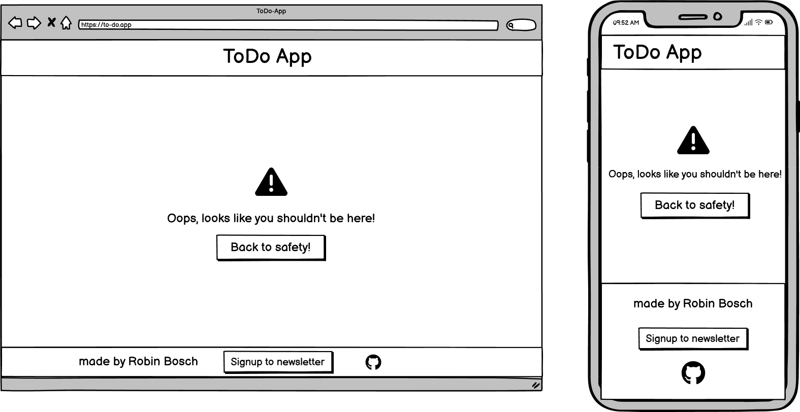
</details>

## Technologies Used  

### Languages

- HTML  
- CSS
- JavaScript

### Frameworks

- Font Awesome
- Google Fonts

### Tools

- Git
- GitHub
- Visual Studio Code
- Balsamiq

### Pages

- [CSS Generators](<https://html-css-js.com/css/generator>) (to generate effects like drop shadows)

## Features

The website has 1 page only. This one page contains three hidden modals and a notifications container that cannot be seen all the time.
The page has 9 features in total.

### Tasklist header

- Shows the task heading
- Shows the new task button
- User stories covered: 1, 5, 7

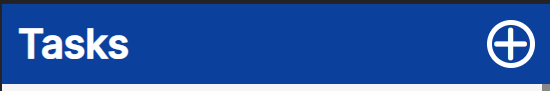

### Tasklist

- Shows a list of tasks
- Sorts task by active/done
- Allows user to mark tasks as active or done
- User stories covered: 6

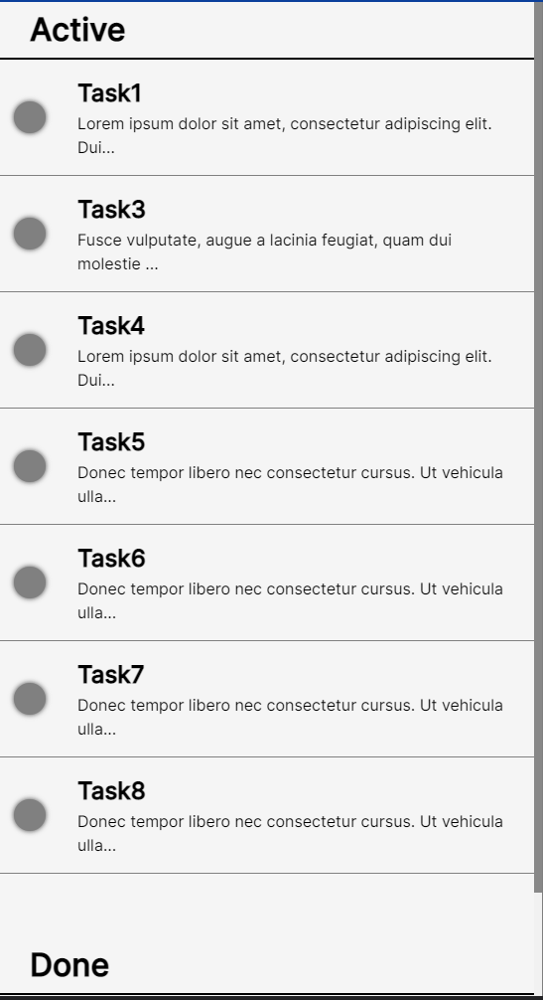

### Task header

- Shows the app heading
- Shows the alert bell, to unlock alerts
- Shows button to toggle the user settings modal
- User stories covered: 4, 9

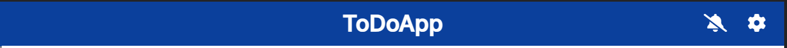

### Task details

- Shows the task title, description, alert date, due date
- Shows button to edit or delete task
- Shows button to mark the task as active/done
- Shows the button to turn off/on the alert for the task
- User stories covered: 2, 3, 5, 7, 8

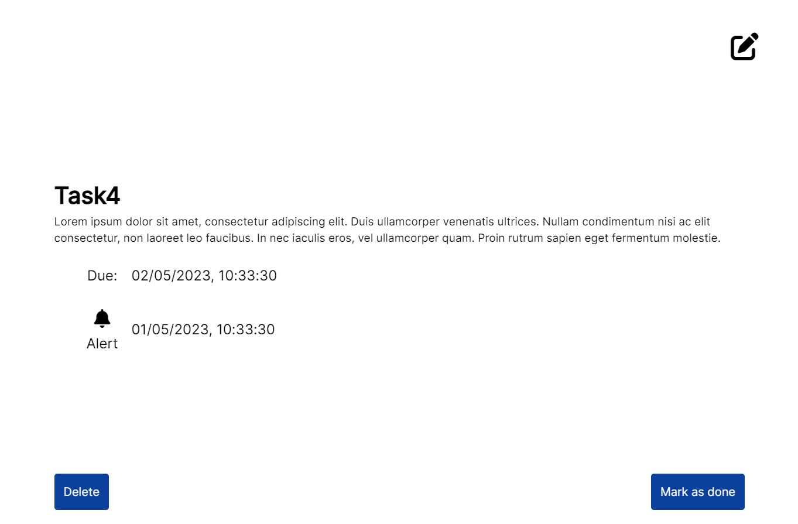

### Footer

- Shows the author of the app
- Shows the toggle to the newsletter modal
- Shows the link to the github repository of the app
- User stories covered: 10, 11, 12


### Task modal

- Allows for editing or creating a new task
- Can be reached from the new task button or the edit button in the task details
- User stories covered: 6, 7

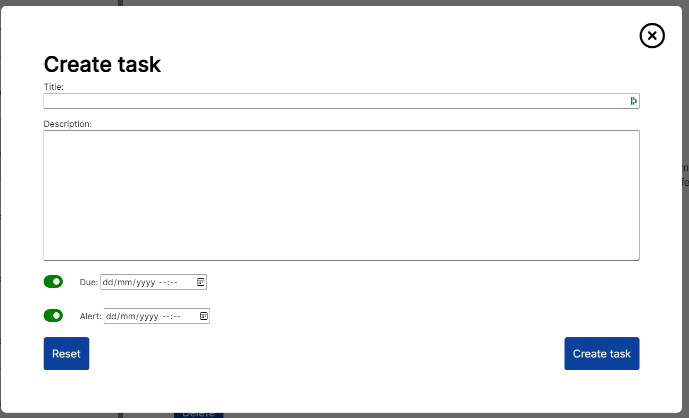
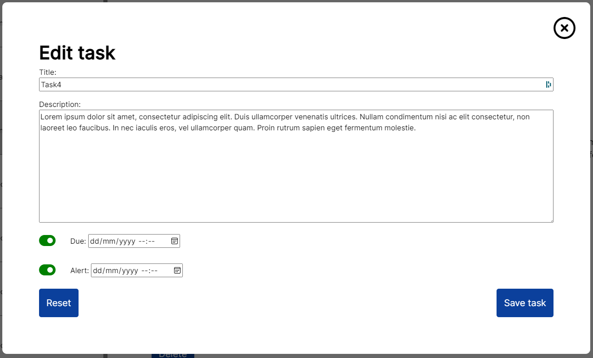

### User settings modal

- Allows for settings personal setting
- The following settings can be set:

  - Theme color
  - Sound volume
  - Sound type

- Save settings or cancel
- User stories covered: 9


### Newsletter modal

- Form with name and email
- Allows for subscribing to the newsletter
- User stories covered: 10

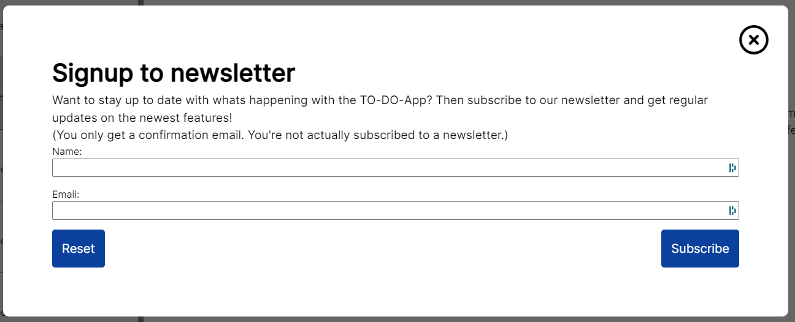

### Notifications feature

- Gives the user information about what is happening

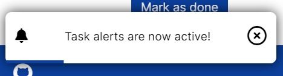

## Validation and Testing

### HTML Validation

All HTML validation tests have been passed.  

<details>
 <summary>Index page</summary>
 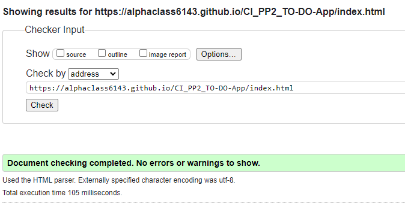
</details>

<details>
 <summary>404 page</summary>
 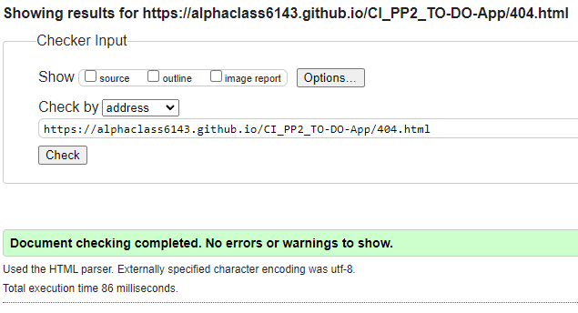
</details>

### CSS Validation

The full website gets errors in the CSS validation test from the font awesome framework.  
Validating the single files passes the tests.  
Variables can't be validated, they show up as warnings.  

<details>
 <summary>Modals CSS</summary>
 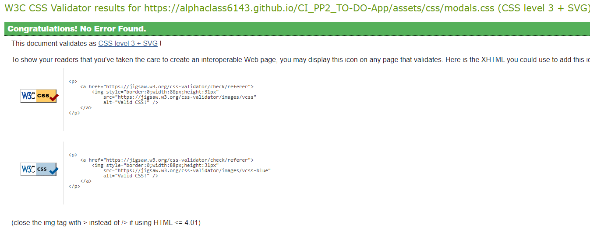
</details>

<details>
 <summary>Reset CSS</summary>
 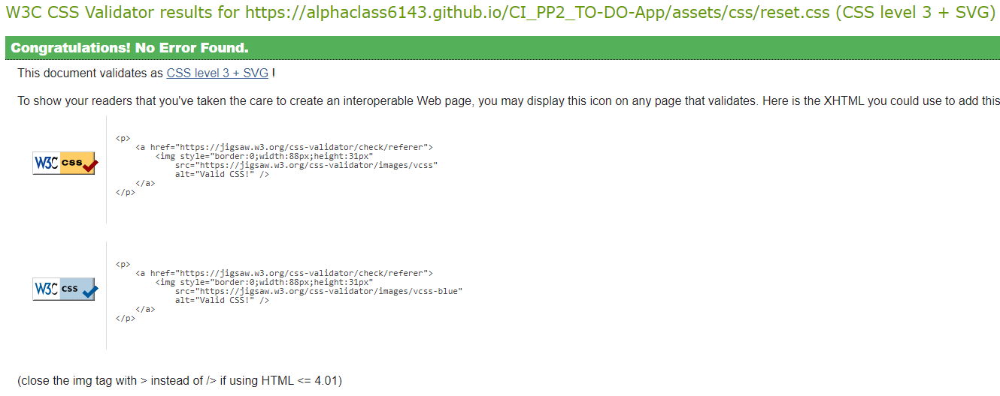
</details>

<details>
 <summary>Styles CSS</summary>
 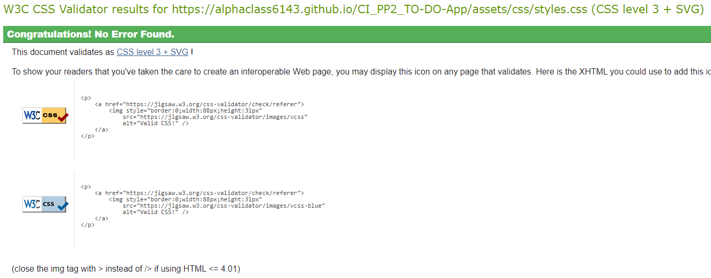
</details>

<details>
 <summary>Tasklist CSS</summary>
 
</details>

<details>
 <summary>Task overview CSS</summary>
 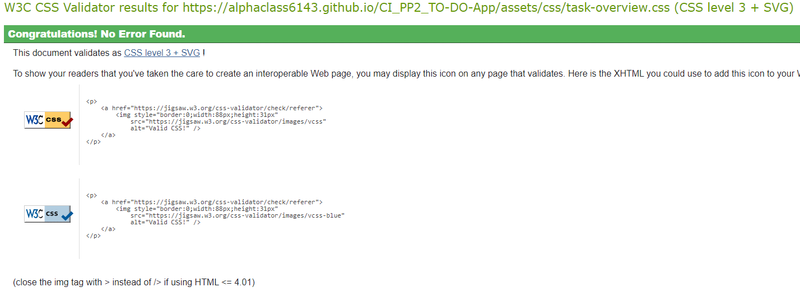
</details>

<details>
 <summary>Notifications CSS</summary>
 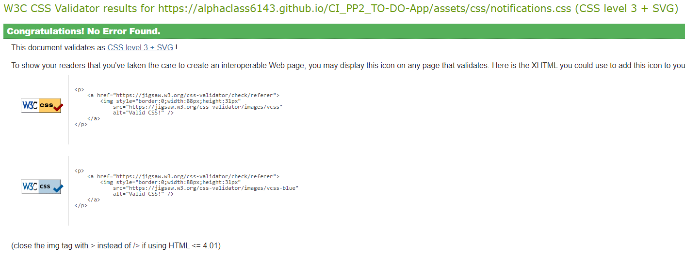
</details>

### JavaScript Validation

Running JSHint directly in the browser results in unused variables which are all functions used in the DOM.  
Running JSHint locally results in no errors.  
JSHint was run locally from the command line. The config for the command line tool is in the repository which just contains the ES-version.

#### Reproduce JavaScript validation locally

1. Install JSHint globally with npm to use as command line tool

```
npm install -g jshint
```

2. Change directory to the script folder
3. Run the following command:

```
npx jshint . --config ../../.jshintrc
```

This will run jshint with the config from the repository

<details>
 <summary>Script validation from the browser</summary>
 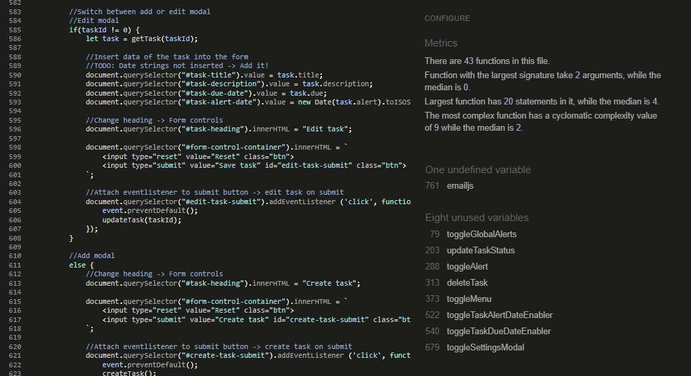
</details>

### Accessibility

All Wave accessibility tests pass with a few alerts.

<details>
 <summary>Index page</summary>
 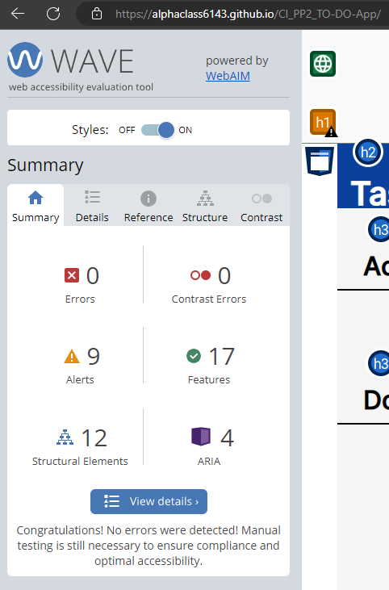
</details>

<details>
 <summary>404 page</summary>
 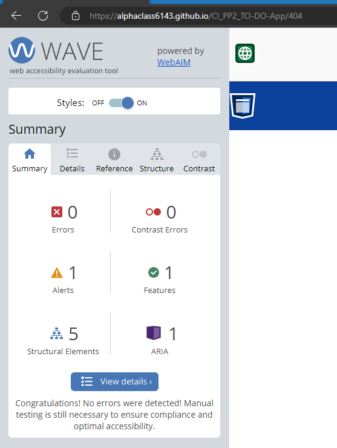
</details>


### Performance

The lighthouse tests were good.  
Below are all reports to every page.

<details>
 <summary>Index page</summary>
 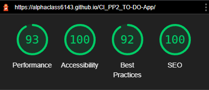
 <br>
 <a href="docs/validation/lighthouse/lighthouse-report-index.pdf">Read full report to Index page (PDF)</a>
</details>

<details>
 <summary>404 page</summary>
 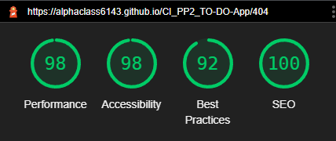
 <br>
 <a href="docs/validation/lighthouse/report/lighthouse-404-index.pdf">Read full report to 404 page (PDF)</a>
</details>

### Device testing

The website was tested on the following devices:

- Windows 11 PC (Screen resolution: 2560x1440)
- Xiaomi MI 9 with Android 11 (Screen resolution: 1080x2280)

Other screen resolutions were tested in the browser with dev tools from 2560x1440 down to 320x568.

### Browser compatibility

The following browser were tested:

- Microsoft Edge (Chromium based version)
- Google Chrome
- Mozilla Firefox

Webkit based browser (Safari) could not be tested. Chromium based and Quantum based browser should be working.

### Testing user stories

#### As a user I want to

1. View all my tasks

|Feature|Action|Expected result|Actual result|
|---|---|---|---|
Task list|The list is to the left or can be expanded with the menu toggle on the left|Task list can be viewed|Works as expected|

<details>
 <summary>Screenshot</summary>

 <br>
 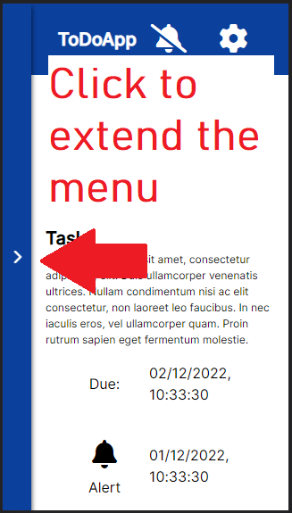
</details>

2. See the details of one task

|Feature|Action|Expected result|Actual result|
|---|---|---|---|
Task details|Select one task from the task list and click it|Shows the task details|Works as expected|

<details>
 <summary>Screenshot</summary>
 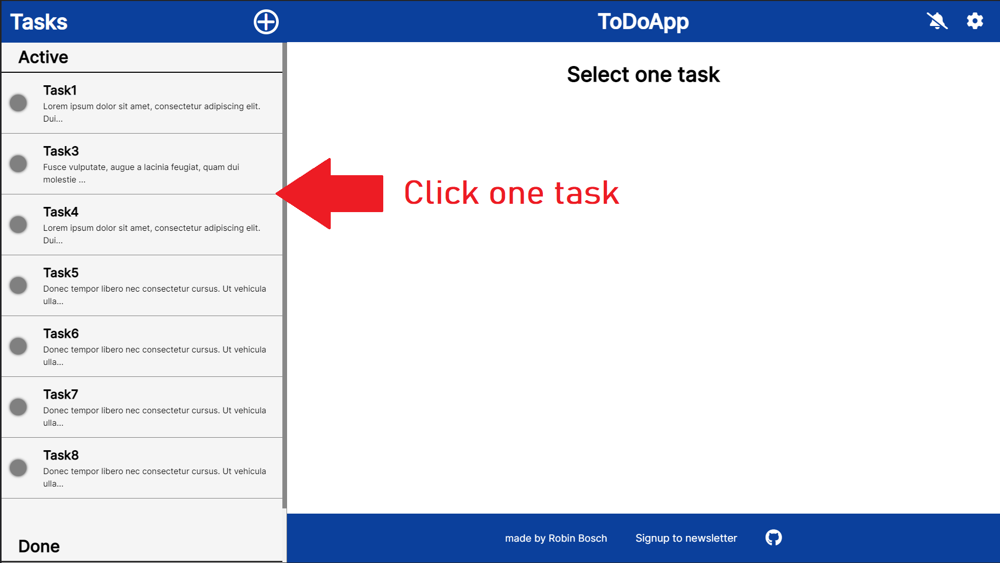
 <br>
 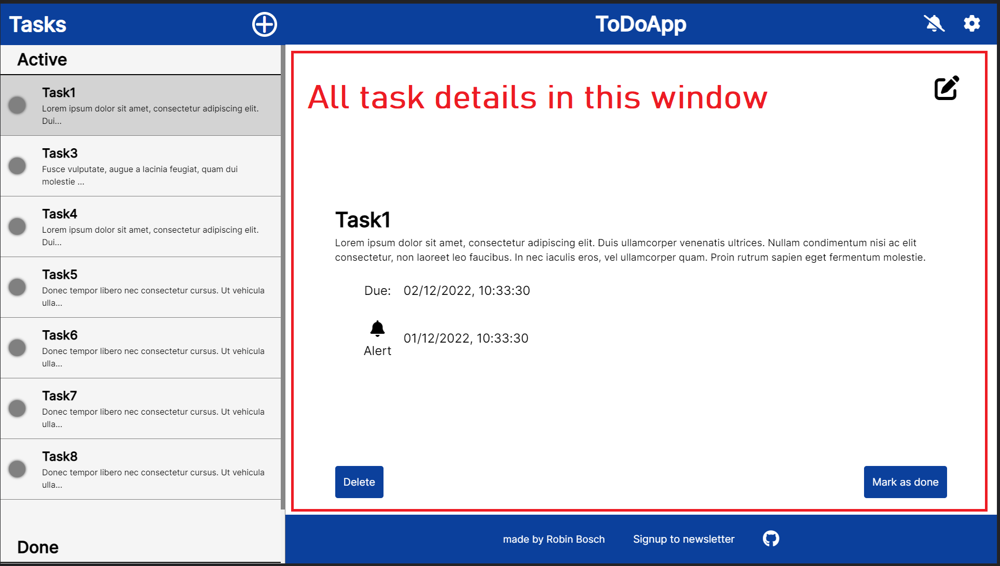
</details>

3. Turn off alerts for one task

|Feature|Action|Expected result|Actual result|
|---|---|---|---|
Toggle bell in task details|In the details click on the bell|Turns on or off the alerts for the task|Works as expected|

<details>
 <summary>Screenshot</summary>
 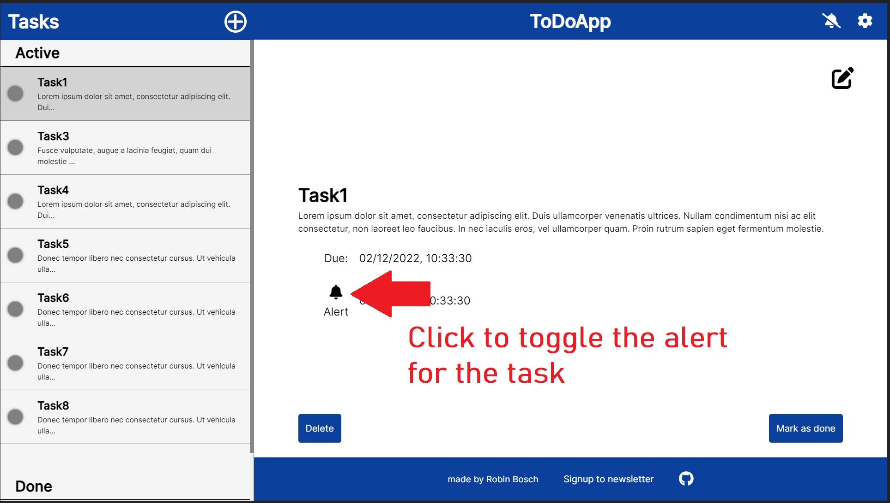
</details>


4. Turn off all alerts.

|Feature|Action|Expected result|Actual result|
|---|---|---|---|
Alert bell button|Clicking the bell|Turns on/off alerts|Works as expected (With one problem: Alerts are turned off on every reload of the page, the browser does not allow for sounds to play before an interaction with the page has taken place)|

<details>
 <summary>Screenshot</summary>
 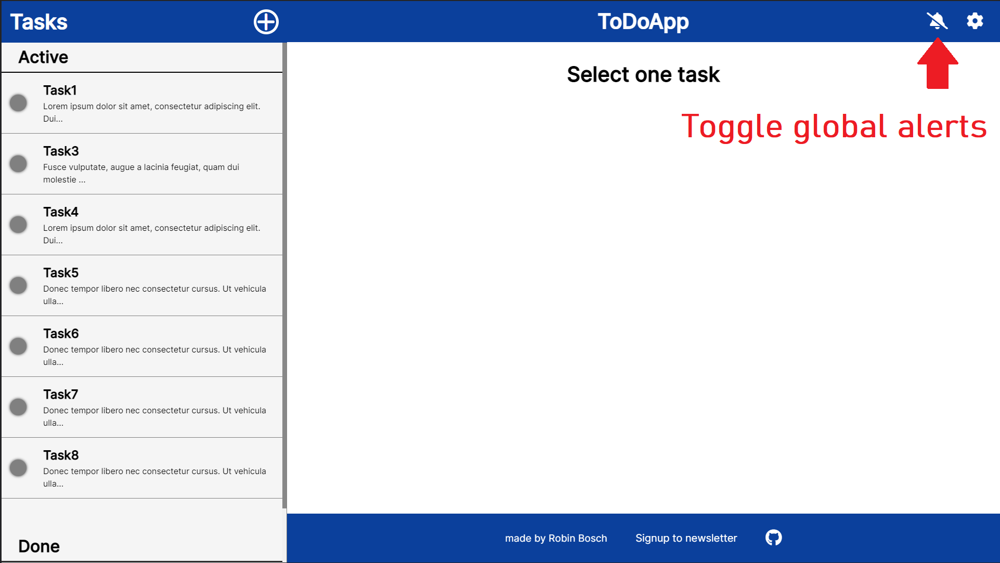
</details>

5. Mark a task as done.

|Feature|Action|Expected result|Actual result|
|---|---|---|---|
Circle checkbox in the task in task list|Clicking the circle checkbox will toggle the task to be active/done|The user can mark the task as done/active|Works as expected|
Mark as done/Unmark button in task details|Clicking the button will toggle the task to be active/done|The user can mark the task as done/active|Works as expected|

<details>
 <summary>Screenshots</summary>
 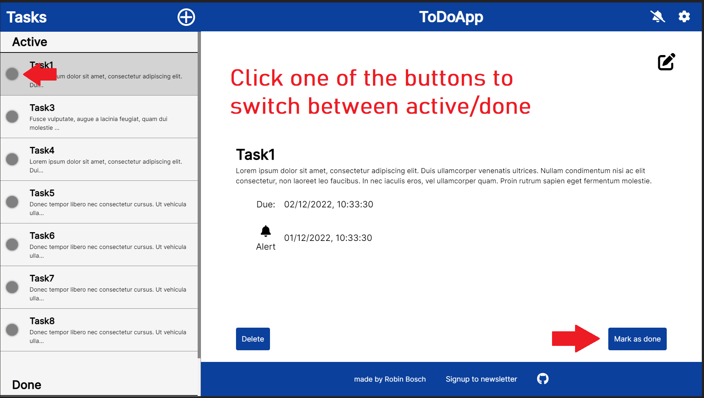
</details>

6. Create a new task.

|Feature|Action|Expected result|Actual result|
|---|---|---|---|
Create task modal|Click on the "Plus" button to open the modal|The task modal opens to fill out the form|Works as expected|

<details>
 <summary>Screenshot</summary>
  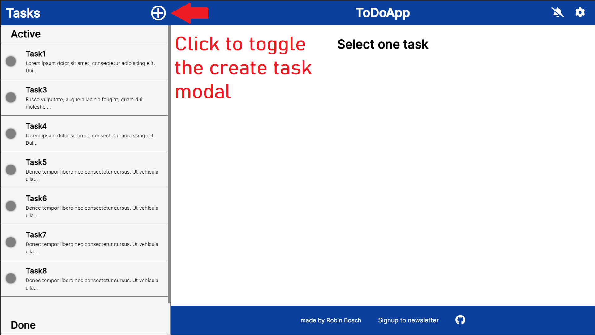
 <br>
 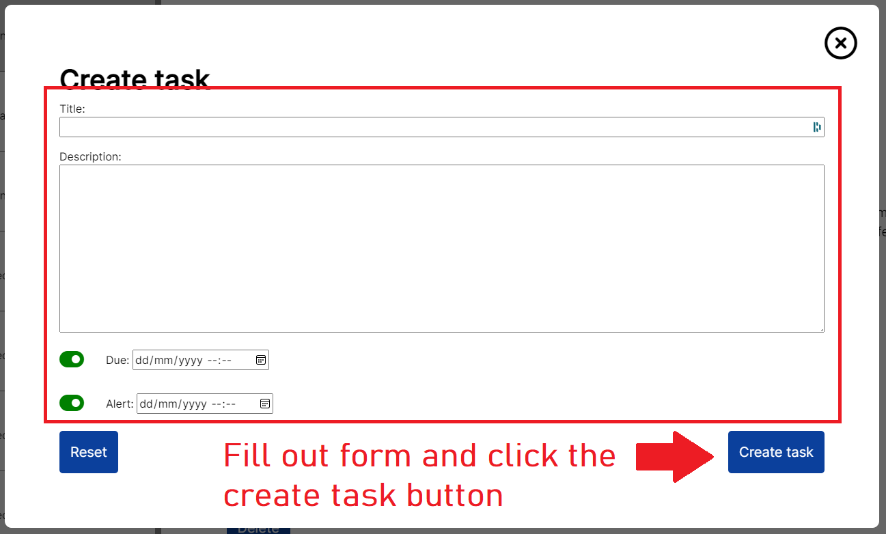
</details>

7. Edit task.

|Feature|Action|Expected result|Actual result|
|---|---|---|---|
Edit button in task details open the edit task modal|Click on the edit button and edit the task|Allows for editing the task|Works as expected|

<details>
 <summary>Screenshot</summary>
  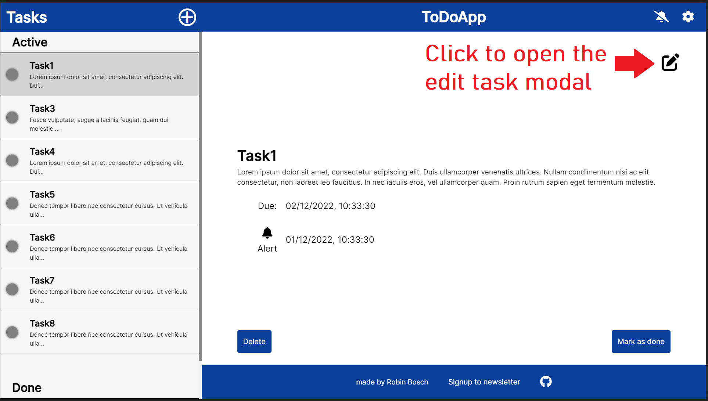
 <br>
 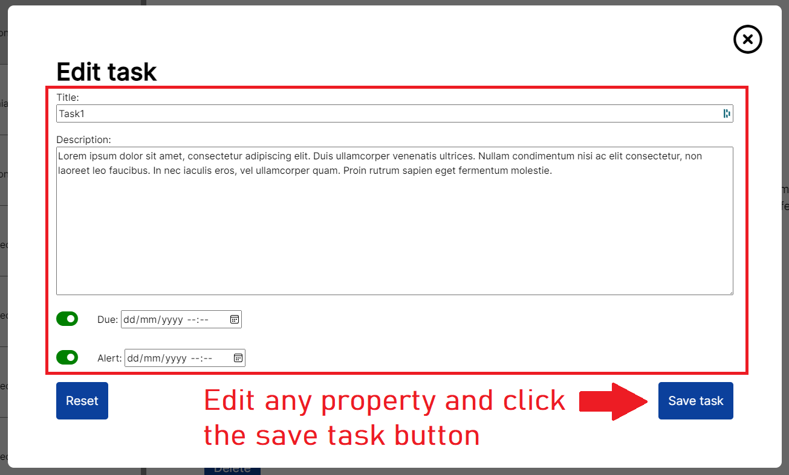
</details>

8. Delete task.

|Feature|Action|Expected result|Actual result|
|---|---|---|---|
Delete button in task details|Click the delete button and confirm the prompt|Deletes the task|Works as expected|

<details>
 <summary>Screenshot</summary>
 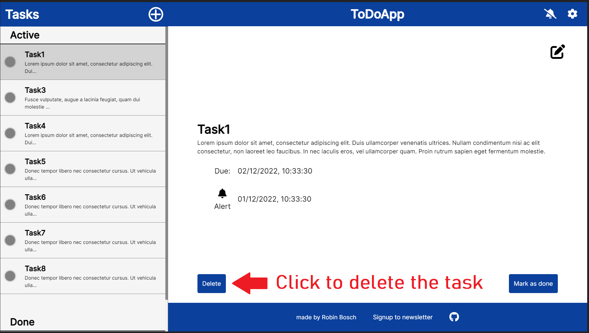
</details>

9. Change the user settings

|Feature|Action|Expected result|Actual result|
|---|---|---|---|
Settings modal|Click the user settings button to open the user settings modal and change the settings and save|Changes user settings|Works as expected|

<details>
 <summary>Screenshot</summary>
  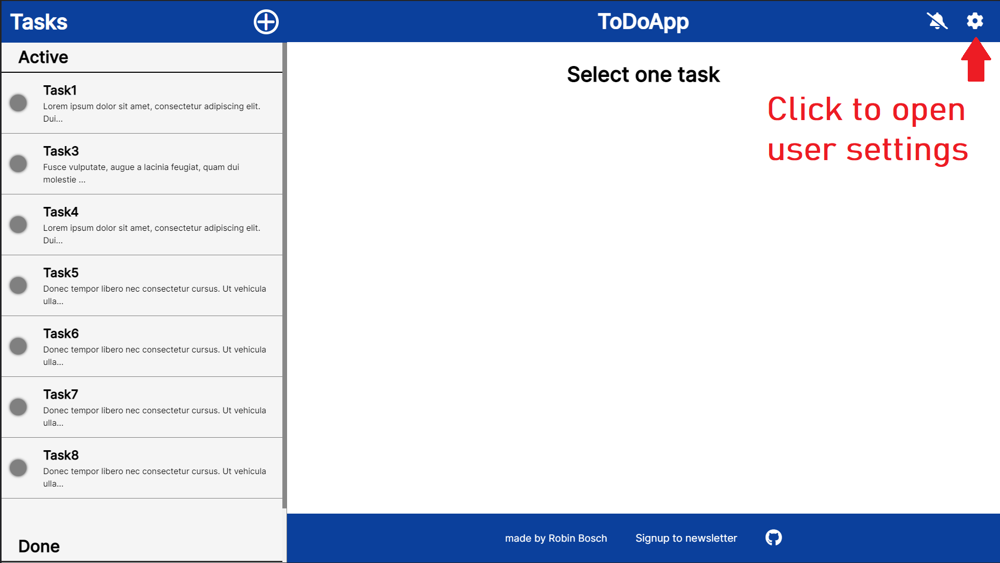
 <br>
 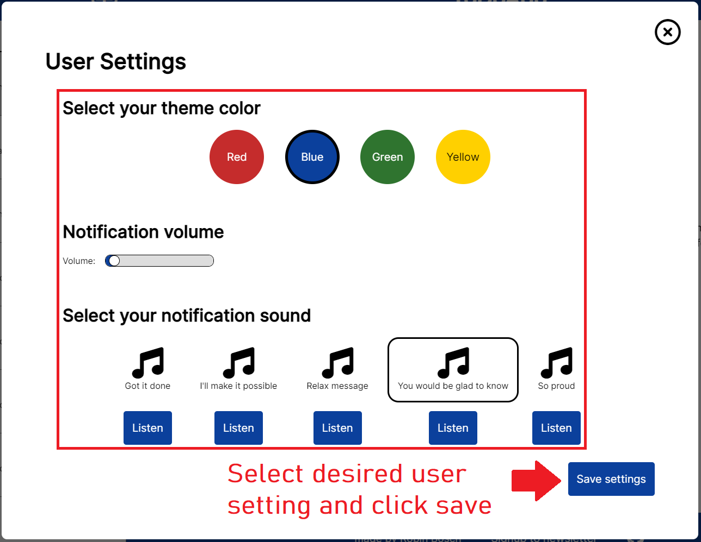
</details>

#### As an owner I want the user to

10. Subscribe to my newsletter

|Feature|Action|Expected result|Actual result|
|---|---|---|---|
Newsletter modal|Click the Signup to newsletter button in the footer, then enter the name and email and click subscribe|Subscribes the user to the newsletter|Works as expected|

<details>
 <summary>Screenshot</summary>
  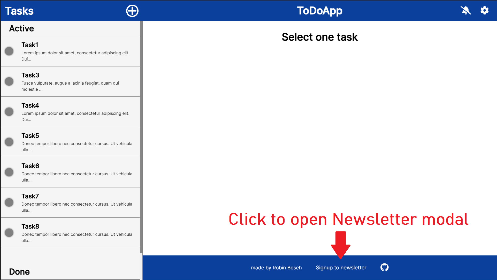
 <br>
 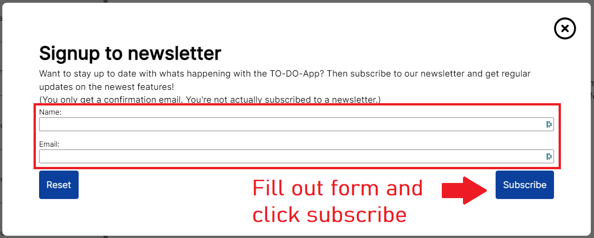
</details>


11. Know who made the website

|Feature|Action|Expected result|Actual result|
|---|---|---|---|
Footer author note|Scroll to the bottom|Shows the author of the app|Works as expected|

<details>
 <summary>Screenshots</summary>
 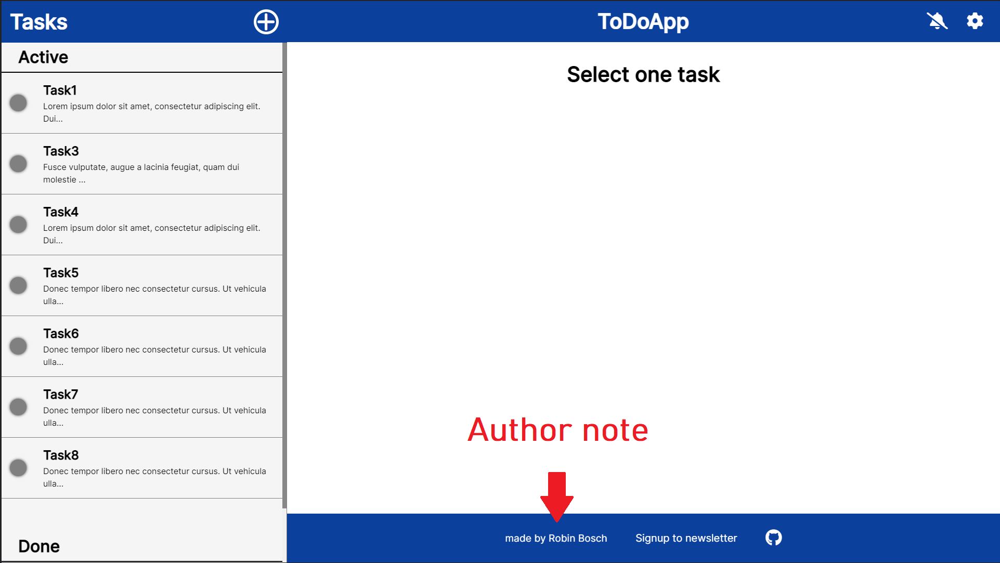
</details>

12. See the code

|Feature|Action|Expected result|Actual result|
|---|---|---|---|
Footer GitHub link|Click the GitHub icon at the bottom of page|Shows the repository|Works as expected|

<details>
 <summary>Screenshot</summary>
 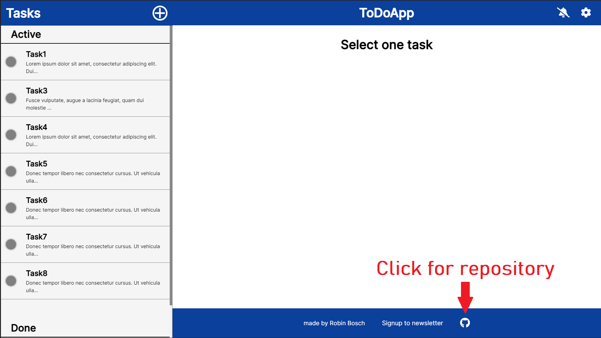
</details>

## Bugs

|Status|Bug|Fix|
|---|---|---|
|Unknown (likely fixed)|The modals occasionally flash on the screen on reload. They disappear after less than half a second after loading. The cause is unclear.|Most likely fixed during the redevelopment of the modals.|
|Fixed|Incorrect input type for the email input on the newsletter signup|Changed the input type to email|

## Deployment

1. In the GitHub repository navigate to the "Settings" tab
2. On the left hand menu select "Pages"
3. For the source select Branch: master
4. After the webpage refreshes automatically you will see a box at the top saying: "Your site is live at <https://robin-bosch.github.io/CI_PP2_TO-DO-App/>"

You can fork the repository by following these steps:

1. Go to the repository on GitHub  
2. Click on the "Fork" button in the upper right hand corner

You can clone the repository by following these steps:

1. Go to the repository on GitHub
2. Locate the "Code" button above the list of files and click it  
3. Select if you prefer to clone using HTTPS, SSH, or Github CLI and click the "copy" button to copy the URL to your clipboard
4. Open Git Bash
5. Change the current working directory to the one where you want the cloned directory
6. Type git clone and paste the URL from the clipboard ($ git clone <https://github.com/YOUR-USERNAME/YOUR-REPOSITORY>)  
7. Press Enter to create your local clone.

## Credits

### Media

Sounds are from Notification Sounds  
[Notification Sounds](<https://notificationsounds.com/>)

Icons are taken from Font Awesome:  
[FontAwesome](<https://fontawesome.com/>)

### Code

CSS Reset has been used in the reset.css file.  
It was written by Andy Bell in a blog post:  
[Blog post](<https://piccalil.li/blog/a-modern-css-reset/>)

Guides on Flexbox and Grid from CSS-Tricks, that have been used multiple times as a reference.  
[Complete Guide to Grid](<https://css-tricks.com/snippets/css/complete-guide-grid/>)  
[Complete Guide to Flexbox](<https://css-tricks.com/snippets/css/a-guide-to-flexbox/>)  

### Acknowledgements

- A special thanks to my mentor Mo Shami for his feedback and advice, especially on the documentation.
- A thanks to the Code Institute for the great learning resources

## License

This project is published under the MIT license.  
[License](/LICENSE.txt)
