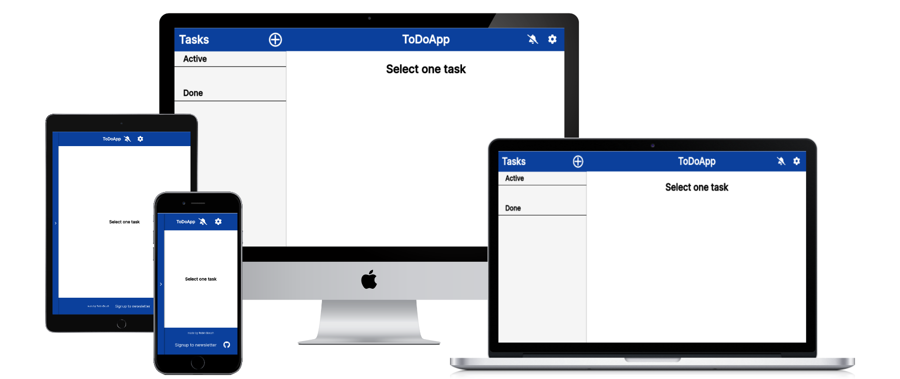

# TO-DO-App

(Developer: Robin Bosch)

[Live webpage](https://alphaclass6143.github.io/WhatsMyPC/)

## Table of Content

1. [Project Goals](#project-goals)
    1. [User Goals](#user-goals)
2. [User Experience](#user-experience)
    1. [Target Audience](#target-audience)
    2. [User Requirements and Expectations](#user-requirements-and-expectations)
    3. [User Stories](#user-stories)
3. [Design](#design)
    1. [Design Choices](#design-choices)
    2. [Colors](#colors)
    3. [Fonts](#fonts)
    4. [Structure](#structure)
    5. [Wireframes](#wireframes)
4. [Technologies Used](#technologies-used)
    1. [Languages](#languages)
    2. [Frameworks](#frameworks)
    3. [Tools](#tools)
    4. [Pages](#pages)
5. [Features](#features)
6. [Validation and Testing](#validation-and-testing)
    1. [HTML Validation](#html-validation)
    2. [CSS Validation](#css-validation)
    3. [JavaScript Validation](#javascript-validation)
    4. [Accessibility](#accessibility)
    5. [Performance](#performance)
    6. [Device testing](#device-testing)
    7. [Browser compatibility](#browser-compatibility)
    8. [Testing user stories](#testing-user-stories)
7. [Bugs](#bugs)
8. [Deployment](#deployment)
9. [Credits](#credits)
    1. [Media](#media)
    2. [Code](#code)
    3. [Acknowledgements](#acknowledgements)
10. [License](#license)

## Project Goals

### User Goals

## User Experience

### Target Audience

### User Requirements and Expectations

### User Stories

## Design

### Design Choices

### Colors

### Fonts

### Structure

### Wireframes

## Technologies Used  

### Languages

### Frameworks

### Tools

### Pages

## Features

## Validation and Testing

### HTML Validation

### CSS Validation

### JavaScript Validation

### Accessibility

### Performance

### Device testing

### Browser compatibility

### Testing user stories

## Bugs

## Deployment  

## Credits

### Media

### Code

### Acknowledgements

## License

This project is published under the MIT license.  
[License](/LICENSE.txt)
